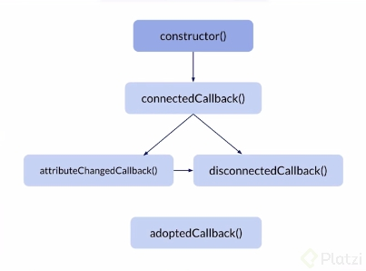

# ¿Qué Son?.
Los Web Components son primitivos de bajo nivel que te permiten definir tus propios
elementos HTML.
Estan construidos por APIs del navegador conocidas como Web APIs, algunas otras son:
* HTML Templates
* Custom Elements
* Shadow DOM -> Here is where magic happend
* ES Modules

El Shadow DOM lo podemos ver en la etiqueta de video que tiene clases y componentes
por default. Entonces genera una encapsulacion que permite que el codigo que este dentro de la etiquta
no coexista con el codigo de afuera.

### Beneficios 
* Reutilización
* Legibilidad 
```html
<card-component is-confirmable is-cancelable>
    <card-header title="Header title" subtitle="Header subtitle"></card-header>
    <card-body title="Body title">Shop</card-body>
    <card-footer>More text</card-footer>
</card-componet>
```
* Mantenibilidad
* Interoperabilidad
* Consistencia

### Ciclo de vida de un componente 
Estan totalmente ligados al DOM, parte fundamental del `critical rendering path`.
